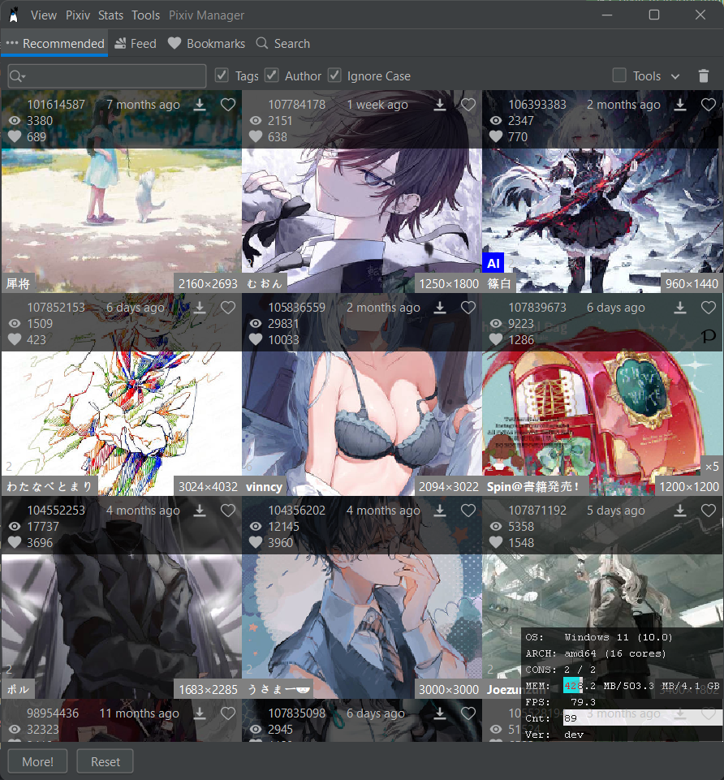
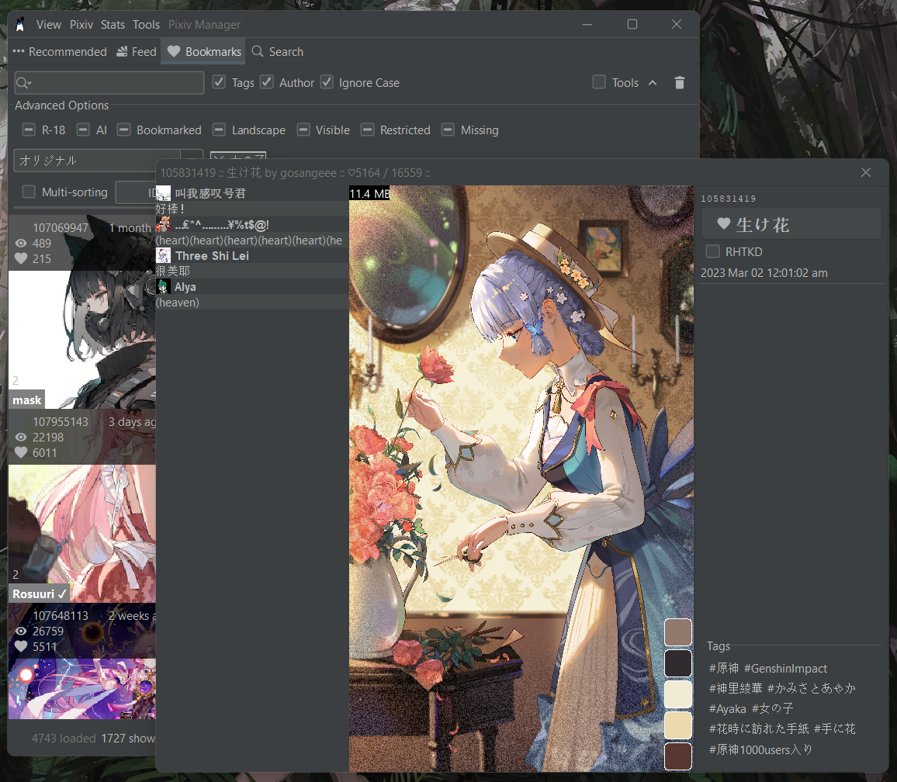

# Pixiv Manager

Made this tool coz I am too lazy to download each illustration after bookmarking them (especially on other devices).

Then I added more functions to help me find images I want.

## Screenshots

## Filter (Tristate)

- R-18
- AI
- Landscape
- Visible
- Restricted
- Bookmarked
- Tags
    - Contains all tag specified
- Tools
    - Uses all tools specified
- Search bar
    - Contains query

## Sorting (Bidirectional + Multi-sorting)

- ID
- Views
- Bookmarks
- Bookmarks per View
- Date
- Sanity (How erotic it is)
- Pixel
- Pages
- sRGB difference to chosen color
- Hue difference to chosen color

## Other functions

- Bookmark toggle
- Download
- Drag & Drog / Copy (as file)
- Open in Pixiv/Local
- Follow toggle
- Artist page
- Recommend page
- Feed page (+ ranking page)
- Bookmark page
- Advanced search page (+tags, bookmark count, autocomplete)

## Problems

- Amateur and naive optimizing
    - Hundreds of megabytes of I/O.
    - Memory usage at gigabyte scale.
    - FPS barely above 60 on 1650ti.
    - Rare but lag spikes exists.

## Running it

Requires your pixiv refresh token.

Requires a custom fork of pixivj, maybe I will try to remove this dependency in the future.

(Cloning this repository does not mean you can run it)
